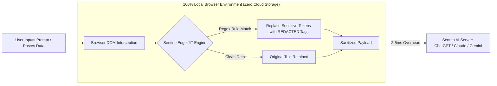

# SentinelEdge — Zero-Latency Data Protection for the Gen-AI Era 🛡️⚡

[](file:///d:/Projects/ikigai%20frontend/index.html)
[](file:///d:/Projects/ikigai%20frontend/index.html)
[](file:///d:/Projects/ikigai%20frontend/index.html)
[](file:///d:/Projects/ikigai%20frontend/assets/sentineledge-v3.0.0.zip)
[](https://github.com/arhamajaz/ikigai-hackathon-frontend)
[](https://github.com/arhamajaz/ikigai-hackathon.git)

> **SentinelEdge** is a 100% client-side, regex-powered Just-In-Time (JIT) data masking browser extension and enterprise platform. It protects enterprise secrets, API keys, credentials, and Personally Identifiable Information (PII) from Generative AI data leaks in real-time with **2-5ms ultra-low latency**.

---

## 🔗 Repositories & Source Code

* **Frontend Web Application & Extension Landing:** [ikigai-hackathon-frontend](https://github.com/arhamajaz/ikigai-hackathon-frontend)
* **Backend Source Code:** [https://github.com/arhamajaz/ikigai-hackathon.git](https://github.com/arhamajaz/ikigai-hackathon.git)

---

## 📌 Table of Contents

- [Overview & Value Proposition](#-overview--value-proposition)
- [Key Features](#-key-features)
- [System Architecture & Data Flow](#-system-architecture--data-flow)
- [Interactive Live Sandbox](#-interactive-live-sandbox)
- [Tech Stack](#-tech-stack)
- [Repository Structure](#-repository-structure)
- [Installation & Setup](#-installation--setup)
  - [1. Running the Web Platform Locally](#1-running-the-web-platform-locally)
  - [2. Sideloading the Extension (Chrome / Edge / Brave)](#2-sideloading-the-extension-chrome--edge--brave)
- [Enterprise Compliance & Zero-Cloud Privacy](#-enterprise-compliance--zero-cloud-privacy)
- [User Manual & Documentation](#-user-manual--documentation)
- [License & Contact](#-license--contact)

---

## 🛡️ Overview & Value Proposition

As enterprise adoption of Generative AI tools (ChatGPT, Claude, Google Gemini, and custom LLM portals) explodes, employees risk inadvertently pasting proprietary code, AWS secret keys, customer PII, and financial data into AI prompts.

**SentinelEdge** acts as an air-gapped, zero-latency firewall operating directly inside the browser's Document Object Model (DOM). By redacting confidential payloads **before** requests hit remote LLM endpoint servers, SentinelEdge guarantees corporate security without breaking developer or enterprise workflows.

---

## ✨ Key Features

- **⚡ 2–5ms Ultra-Low Scan Latency:** Intercepts prompt submit events and clipboard actions near-instantaneously without noticeable user delay.
- **🔒 100% Air-Gapped / On-Device Redaction:** All regex engine calculations happen inside browser memory. Zero prompt text, clipboard payloads, or API tokens are transmitted to external servers.
- **🎯 50+ Pre-Configured DLP Regex Rules:** Automatically identifies and masks:
  - **API Keys & Credentials:** AWS (`AKIA...`), OpenAI (`sk_live_...`), GitHub PAT (`ghp_...`), JWT tokens.
  - **Personally Identifiable Information (PII):** Social Security Numbers (SSN), Email Addresses, Credit Card Numbers, Phone Numbers.
- **🧪 Interactive JIT Masking Sandbox:** Built-in web playground for real-time redaction simulation and custom rule verification.
- **📹 Embedded Video Demo & User Manual:** Includes product video walkthrough and downloadable PDF enterprise deployment guide.
- **📊 Compliance & Audit HUD:** Provides local incident telemetry counters and one-click JSON compliance export capability for enterprise security teams.

---

## 🏗️ System Architecture & Data Flow



---

## 🧪 Interactive Live Sandbox

The web application features an interactive **Live JIT Engine Sandbox** that simulates real-time data redaction.

### Supported Test Tokens:
- **API Keys:** `sk_live_99a8b7c6d5e4f3a21098` ➔ `<span class="redacted-tag">[REDACTED_API_KEY]</span>`
- **Email Addresses:** `john.doe@sentineledge.io` ➔ `<span class="redacted-tag">[REDACTED_EMAIL]</span>`
- **SSNs:** `000-12-3456` ➔ `<span class="redacted-tag">[REDACTED_SSN]</span>`
- **Credit Cards:** `4532 1122 3344 5566` ➔ `<span class="redacted-tag">[REDACTED_CREDIT_CARD]</span>`

---

## 💻 Tech Stack

| Component | Technology / Specification |
| :--- | :--- |
| **Frontend UI** | HTML5 (Semantic Structure, OpenGraph, SEO Optimized) |
| **Styling** | Vanilla CSS3 (Custom CSS Variables, Glassmorphism, Cyberpunk Dark Theme) |
| **Client Engine** | Vanilla JavaScript (ES6+, DOM Manipulation, Real-time Regex Engine) |
| **Extension Architecture** | Chrome Extension Manifest V3 |
| **Backend Integration** | [Ikigai Hackathon Backend Service](https://github.com/arhamajaz/ikigai-hackathon.git) |

---

## 📁 Repository Structure

```
ikigai-hackathon-frontend/
├── index.html                # Main enterprise landing page, sandbox & webstore specs
├── styles.css                # Enterprise dark design system, responsive styles & UI components
├── script.js                 # JIT masking logic, video controller & toast notifications
├── sentineledge-v3.0.0.zip   # Packaged Chrome/Edge extension binary (root release)
├── user manual .pdf         # Enterprise Administrator Guide (root copy)
└── assets/
    ├── demo-video.mp4        # Interactive product demonstration video
    ├── video-thumbnail.jpg   # Video poster image overlay
    ├── SentinelEdge-UserGuide.pdf # Official PDF User Manual
    ├── user-manual.pdf       # Secondary user manual reference
    └── sentineledge-v3.0.0.zip # Extension release package copy
```

---

## 🚀 Installation & Setup

### 1. Running the Web Platform Locally

No heavy build tools or Node.js dependencies are required. You can serve the static site directly:

#### Option A: Using Python (HTTP Server)
```bash
# Navigate to project directory
cd "ikigai frontend"

# Start local server on port 8000
python -m http.server 8000
```
Open `http://localhost:8000` in your web browser.

#### Option B: Using VS Code Live Server
1. Open the workspace folder in VS Code.
2. Right-click `index.html` and select **"Open with Live Server"**.

---

### 2. Sideloading the Extension (Chrome / Edge / Brave)

1. Download or locate `assets/sentineledge-v3.0.0.zip` in the repository.
2. Extract the `.zip` archive to a folder on your computer.
3. Open your browser and navigate to:
   - Chrome / Brave: `chrome://extensions`
   - MS Edge: `edge://extensions`
4. Enable **Developer mode** (toggle in the top-right corner).
5. Click **Load unpacked**.
6. Select the extracted `sentineledge-v3.0.0` folder.
7. SentinelEdge is now active and protecting your AI prompt submissions!

---

## 🔒 Enterprise Compliance & Zero-Cloud Privacy

SentinelEdge is built for strict enterprise compliance environments subject to **SOC2, HIPAA, and GDPR** regulations:

- **Single-Line Privacy Summary:** SentinelEdge handles website content 100% on-device in browser memory. Zero prompt content, clipboard payloads, or intercepted tokens are collected, stored externally, or transmitted to remote servers.
- **Zero Cloud Retention:** No external log collectors or remote API endpoints are contacted.
- **GPO Deployable:** Ready for Enterprise Group Policy (GPO) network distribution across company-managed devices.

---

## 📄 User Manual & Documentation

For detailed administrative setup, custom regex configuration, and verification benchmarks:
- Download the **[SentinelEdge Enterprise User Guide (PDF)](file:///d:/Projects/ikigai%20frontend/assets/SentinelEdge-UserGuide.pdf)** directly from the repository.

---

## 🔗 Related Resources

- **Backend Repository:** [https://github.com/arhamajaz/ikigai-hackathon.git](https://github.com/arhamajaz/ikigai-hackathon.git)
- **Frontend Repository:** [https://github.com/arhamajaz/ikigai-hackathon-frontend](https://github.com/arhamajaz/ikigai-hackathon-frontend)

---

&copy; 2026 **SentinelEdge Security / Ikigai**. All rights reserved. Zero-Cloud Guarantee.
